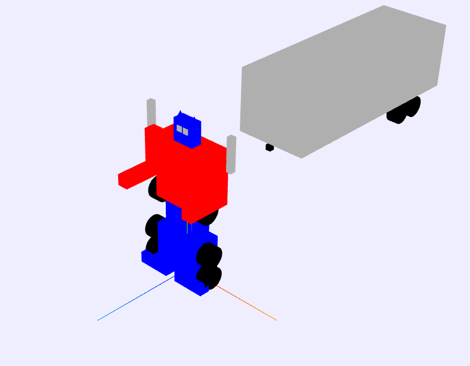
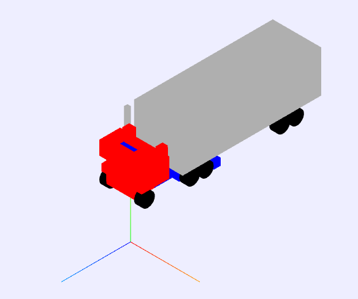

# Interactive Graphics Application - Geometric Modeling, Cameras, Animation, and Collision Detection

This project aims to develop an interactive graphics application that encompasses several key objectives. The primary goals of this project are as follows:

1. Understand and implement the architecture of an interactive graphics application.
2. Explore the fundamental concepts of geometric modeling through primitive instantiation.
3. Utilize virtual cameras to control the viewpoint and provide different perspectives.
4. Differentiate between orthogonal and perspective projections and apply them appropriately.
5. Implement basic animation techniques to bring objects to life.
6. Comprehend and incorporate simple collision detection techniques.

## Robot Image
 
## Project Overview

The objective of this project is to develop an interactive graphics application that encompasses several fundamental concepts and techniques. The key aspects covered in this project include:

1. **Architecture of an Interactive Graphics Application**: The project involves designing and implementing the architecture of an interactive graphics application, which allows users to interact with and manipulate objects in a graphical environment.

2. **Geometric Modeling using Primitive Instantiation**: The application explores the concept of geometric modeling by instantiating primitive objects such as cubes, spheres, and cylinders. These primitives serve as the building blocks for constructing more complex objects.

3. **Virtual Cameras**: The project incorporates virtual cameras to control the viewpoint and provide users with different perspectives of the scene. Users can switch between cameras to observe the scene from various angles and viewpoints.

4. **Orthogonal and Perspective Projections**: The application demonstrates the differences between orthogonal and perspective projections. It utilizes appropriate projection techniques based on the desired visual effects and requirements of the scene.

5. **Animation Techniques**: Basic animation techniques are implemented to bring objects to life. Users can animate objects by applying transformations such as translation, rotation, and scaling. These animations enhance the interactive experience of the application.

6. **Collision Detection**: The project incorporates simple collision detection techniques to detect and respond to collisions between objects. Collision detection algorithms are implemented to ensure realistic and accurate interactions between objects within the scene.

## Technologies Used

The following technologies and tools were used in this project:

- Programming Language: Javascript
- Graphics Library: Three.js

## Installation

1. Clone the project repository: git clone https://github.com/caldas479/robot_graphical_computation

## Usage

To run the project, execute the following steps:

1. Open a terminal or command prompt.
2. Navigate to the project directory: `cd robot_graphical_computation`
3. Open the html file in your browser and have fun

## Features

The interactive graphics application project includes the following features:

- Interactive graphical environment: Users can interact with objects in the scene using keyboard input.
- Rotations keys: Q and A for feet, W and S for legs, E and D for arms and R and F for head.
- Geometric modeling: The application supports the creation and manipulation of objects using primitive instantiation techniques.
- Virtual cameras: Users can switch between virtual cameras to change the viewpoint and observe the scene from different perspectives, using the keys from 1 to 5.
- Orthogonal and perspective projections: The application utilizes appropriate projection techniques based on the desired visual effects and requirements.
- Animation: Basic animation techniques are implemented to animate objects and create dynamic movements when the trailer collides with the robot in the truck mode.
- Collision detection: The project incorporates collision detection algorithms to detect and respond to collisions between objects within the scene.

## Contributing

Contributions to this project are welcome. If you would like to contribute, please follow these steps:

1. Fork the repository.
2. Create a new branch: `git checkout -b feature/your-feature`
3. Make your changes and commit them: `git commit -m 'Add some feature'`
4. Push to the branch: `git push origin feature/your-feature`
5. Submit a pull request.

## License

This project is licensed under the mit. Check (https://rem.mit-license.org) for details.
